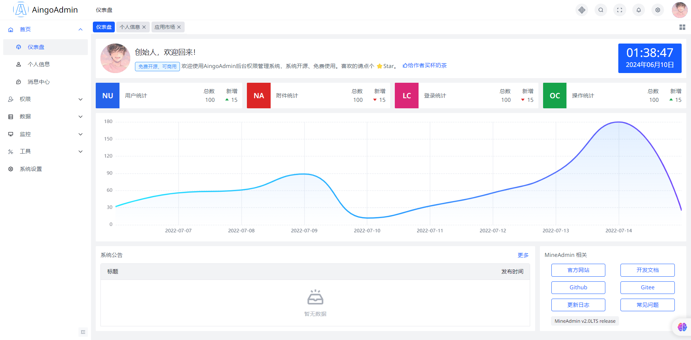
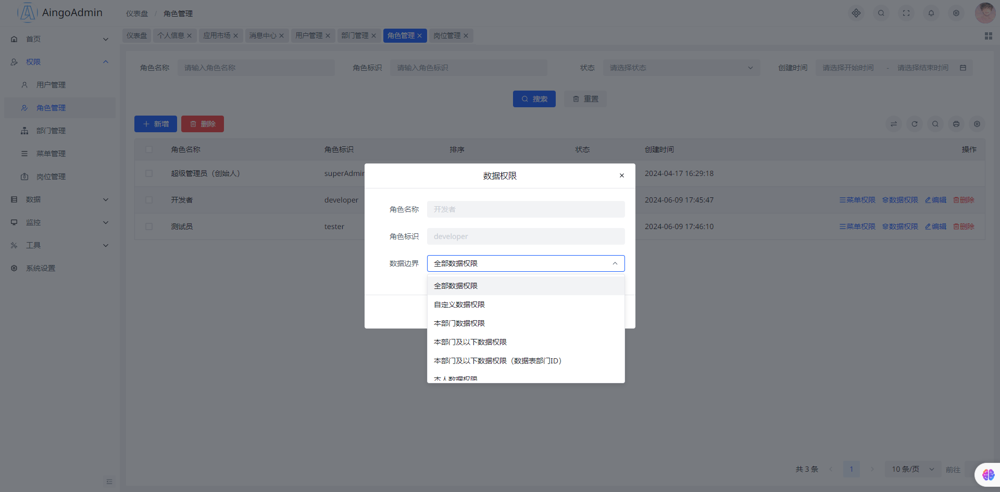
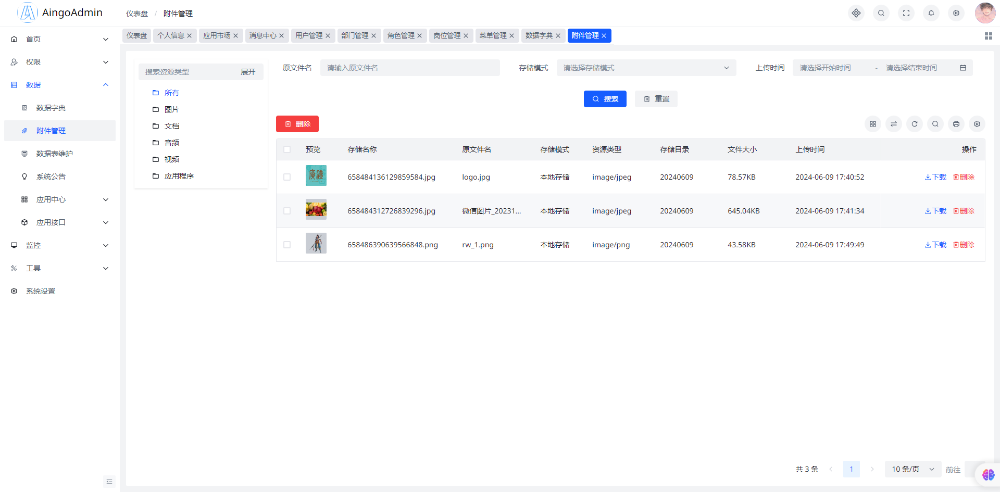

<p align="center">
  
</p>
<p align="center">
  
  
</p>

## 关于
`AingoAdmin` 是基于 后端:[go-gin-api](github.com/xinliangnote/go-gin-api) + 前端:[MineAdmin](https://doc.mineadmin.com/front/route.html) 进行模块化设计的单应用管理后台

供参考学习，持续更新中...

## 后端集成组件
- [go-gin-api](github.com/xinliangnote/go-gin-api)

1. 支持 [rate](https://golang.org/x/time/rate) 接口限流
1. 支持 panic 异常时邮件通知
1. 支持 [cors](https://github.com/rs/cors) 接口跨域
1. 支持 [Prometheus](https://github.com/prometheus/client_golang) 指标记录
1. 支持 [Swagger](https://github.com/swaggo/gin-swagger) 接口文档生成
1. 支持 [GraphQL](https://github.com/99designs/gqlgen) 查询语言
1. 支持 trace 项目内部链路追踪
1. 支持 [pprof](https://github.com/gin-contrib/pprof) 性能剖析
1. 支持 errno 统一定义错误码
1. 支持 [zap](https://go.uber.org/zap) 日志收集
1. 支持 [viper](https://github.com/spf13/viper) 配置文件解析
1. 支持 [gorm](https://gorm.io/gorm) 数据库组件
1. 支持 [go-redis](github.com/redis/go-redis/v9) 组件
1. 支持 RESTful API 返回值规范
1. 支持 生成数据表 CURD、控制器方法 等代码生成器
1. 支持 [cron](https://github.com/jakecoffman/cron) 定时任务，在后台可界面配置
1. 支持 [websocket](https://github.com/gorilla/websocket) 实时通讯，在后台有界面演示


## 前端特性
- [MineAdmin](https://doc.mineadmin.com/front/route.html)

1. 最新技术栈：vue3, vite5, pinia
1. UI库：arco design
1. 国际化：完善的多语言解决方案
1. 权限：内置完善的权限、动/静态路由解决方案
1. 主题：可扩展主题
1. 布局：支持三种布局方式
1. 组件：内置大量基于日常开发锤炼出的组件。
1. 指令：封装了常用指令，如权限控制、角色控制等
1. CRUD表格系统：基于json方式配置，快速对接后台接口，实现增删改查
1. FROM表单系统：基于json方式配置，快速搭建出想要的表单系统，快速完成需求。

## 目录结构
```tree
├─md-img                        // README展示图片
├─server                        // 后端代码  
│  ├─air                        // air代码热更新编译目录
│  ├─cmd                        // 命令行工具
│  │  ├─gen_error               // 生成错误码构建文件 internal/response/errors.proto
│  │  ├─gorm-gen                // gorm代码生成器 internal/schema
│  │  ├─handlergen              // 生成控制器 internal/api
│  │  ├─mfmt                    // 格式化代码
│  │  ├─mysqlmd                 // 生成数据库表markdown结构
│  │  └─protoc-gen-go-error-generator // 根据错误码构建文件生成错误码 internal/response/errcode
│  ├─docs                       // swagger文档
│  ├─internal                   // 业务代码
│  │  ├─alert                   // 告警
│  │  ├─api                     // api接口控制器
│  │  │  └─backend              // 后台管理
│  │  │      ├─admin            // 管理员模块
│  │  │      └─file             // 文件模块
│  │  ├─bootstrap               // 启动
│  │  ├─config                  // 配置
│  │  ├─metrics                 // 监控
│  │  ├─pkg                     // 工具包
│  │  ├─proposal                // 预制数据
│  │  ├─proto_path              // protobuf依赖文件
│  │  ├─response                // 响应
│  │  │  └─errcode              // 错误码
│  │  ├─router                  // 路由
│  │  ├─schema                  // 数据库
│  │  │  ├─accessor             // 访问器
│  │  │  ├─dao                  // 数据访问
│  │  │  └─model                // 模型
│  │  └─services                // service接口
│  │      ├─dto                 // dto
│  │      └─handler             // service实现
│  ├─logs                       // 日志
│  ├─manifest                   // 配置清单
│  │  ├─configs                 // 服务运行配置
│  │  ├─develop                 // 开发工具配置
│  │  │    └─mock               // mock数据
│  │  ├─deploy                  // 部署配置
│  │  └─docker                  // 镜像配置
│  ├─scripts                    // 脚本
└─web-admin                     // 前端代码
    ├─.vscode
    ├─node_modules              // node依赖包
    ├─public                    // 静态资源
    └─src                       // 前端代码
        ├─api                   // api接口
        ├─assets                // 静态资源
        ├─components            // 组件
        ├─config                // 配置
        ├─directives            // 指令
        ├─i18n                  // 国际化
        ├─layout                // 布局
        ├─plugin                // 插件
        ├─router                // 路由
        ├─store                 // vuex
        ├─style                 // 样式
        ├─utils                 // 工具
        ├─views                 // 页面
        └─ws-serve              // websocket服务

```

## 安装使用
### 后端运行
- 安装依赖
```bash
cd server && go mod tidy
```
```bash
go run main.go start
```

### 前端运行

- 安装依赖
```bash
cd web-admin && yarn install
```
- 运行
```bash
yarn dev
```
- 打包
```bash
yarn build
```

## 免责声明
本软件不得用于开发违反国家有关政策的相关软件和应用，若因使用本软件造成的一切法律责任均与 `AingoAdmin` 无关

## 协议说明
`AingoAdmin` 遵循MIT开源协议发布，免费开源。

版权所有Copyright © 2024-2024 by AingoAdmin

All rights reserved。

## 系统截图










## 其他

```
$ go run main.go start -env fat  

// -env 表示设置哪个环境，主要是区分使用哪个配置文件，默认为 fat
// -env dev 表示为本地开发环境，使用的配置信息为：configs/dev_configs.toml
// -env fat 表示为测试环境，使用的配置信息为：configs/fat_configs.toml
// -env uat 表示为预上线环境，使用的配置信息为：configs/uat_configs.toml
// -env pro 表示为正式环境，使用的配置信息为：configs/pro_configs.toml
```

### 接口文档
- 接口文档：http://127.0.0.1:9501/swagger/index.html
- 心跳检测：http://127.0.0.1:9501/system/health

### 错误码构建
```bash
cd server && make error
```
```bash
make gen-error
```
### 控制器构建
```bash
cd server && make gen-api <filename>
```
### 数据库模型构建
```bash
cd server && make model
```

### 开发热启动
```bash
cd server && make air
```

### 开发规范
- MySQL研发规范
- Redis 研发规范
- Git 使用规范
- RESTful API规范
- 核心功能实现
- 第三方组件集成

## 联系作者
该项目只针对管理后台的入门封装，如果对项目感兴趣的可以扫码添加我的微信号，获取最新版本和文档，请备注来源。
